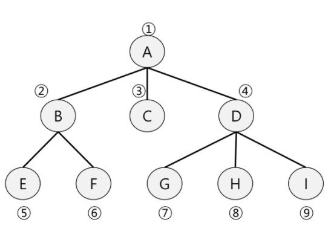

# BFS (너비 우선 탐색)

---

### BFS란?

- BFS는 탐색 시작점의 인접한 정점들을 먼저 모두 차례로 방문한 후에, 방문했던 정점을 시작으로 하여 다시 인접한 정점들을 차례로 방문하는 방식

- 인접한 정점들에 대해 탐색을 한 후, 다시 BFS를 진행해야 하므로 **Queue**를 사용



- DFS와는 달리, 최고 깊이 까지 간 후 돌아오는 것이 아니라, 인접한 모든 정점을 차례대로 방문하고 그 다음 높이의 노드에 반복

- 그래프, 트리, 미로 등에서 활용가능함

---

### BFS 코드

```python
def bfs(v):                 # bfs 반복 코드
    Q.append(v)             # 일단, 시작점을 Q에 넣어준다.
    D[v] = 0                # D는 시작점 부터의 거리
    visited[v] = 1          # visited 방문 해주고
    while Q:                # Q가 빈 리스트가 될 때 까지
        v = Q.popleft()     # Q의 제일 앞인덱스를 뽑아준다.
        for w in G[v]:      # 노드가 갈 수 있는 곳
            if not visited[w]:  # 방문하지 않았다면
                Q.append(w)     # 그 노드를 Q에 append
                visited[w] = 1  # visited 방문하고
                D[w] = D[v] + 1 # 시작점 부터의 거리니까 D[v]에 +1
                P[w] = v        # 부모 저장
```

- 일반적으로 위와 같이 진행

---

### 미로에서의 활용코드

[SWEA_미로1]([SW Expert Academy](https://swexpertacademy.com/main/code/problem/problemDetail.do?contestProbId=AV14vXUqAGMCFAYD))

```python
def bfs(r, c):
    Q.append((r, c))                # 일단, Q에 시작의 인덱스를 튜플로 묶어서 넣어준다.
    visited[r][c] = 1               # visited방문하고
    while Q:                        # Q가 빈리스트가 될 때 까지
        r, c = Q.pop(0)             # 제일 앞의 원소 뽑아주고
        if maze[r][c] == 3:         # 도착한 경우 1을 return하고 종료
            return 1
        for dr, dc in [[1, 0], [0, 1], [-1, 0], [0, -1]]:   # 미로를 탐색
            nr, nc = r + dr, c + dc
            if maze[nr][nc] != 1 and visited[nr][nc] == 0 and 0 <= nr < 16 and 0 <= nc < 16:
                Q.append((nr, nc))
                visited[nr][nc] = 1
    return 0

for y in range(1, 11):
    tc = int(input())
    maze = [list(map(int, input())) for _ in range(16)]
    visited = [[0]*16 for _ in range(16)]
    Q = []

    sr, sc, er, ec = 0, 0, 0, 0
    for i in range(16):             # 시작점과 종료점을 잡아준다.
        for j in range(16):
            if maze[i][j] == 2:
                sr, sc = i, j
            elif maze[i][j] == 3:
                er, ec = i, j

    print(f'#{tc}', bfs(sr, sc))

```

- 위의 코드를 활용해 이런 식으로 미로를 탐색할 수 있다.


