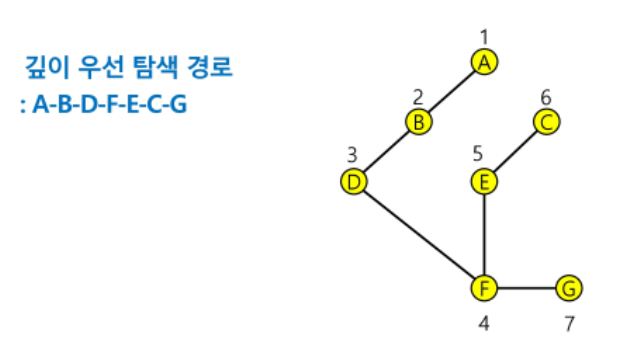

# DFS (깊이 우선 탐색)

---

### DFS란?

- 시작 정점의 한 방향으로 갈 수 있는 경로가 있는 곳까지 깊이 탐색해 가다가 갈 곳이 없게 되면, 가장 마지막에 만났던 갈림길의 갈 수 있는 경로로 다시 탐색하는 방법

- 가장 마지막에 만났던 갈림길의 정점으로 되돌아가야해서 후입선출 구조의 stack사용
  
  

---


### DFS코드 (재귀)

- 나는 계속 재귀를 통한 DFS함수를 작성하고 사용해서 재귀만 쓰겠음.

```python
def dfs(v):                     # 함수에서 자체적으로 내부에 stack이 쌓이므로 따로 stack을 사용하지는 않음.
    visited[v] = 1              # visited에 방문 처리
    for w in G[v]:              # 간선의 정보를 담은 G리스트를 순회
        if visited[w] == 0:     # 방문 안했다면,
            dfs(w)              # dfs 재귀s(w)
```

- 보면, 코드 자체는 굉장히 간단하다..

- 중요한 점은 이를 어떻게 활용하여 알고리즘 문제를 풀 것이냐 이다.

- 또한, 함수 자체에서 stack이 쌓인다고 하는데, 솔직히 재귀에 대해서 아직 잘 모르겠다

---


### 미로에서의 활용 예시

[미로1]([SW Expert Academy](https://swexpertacademy.com/main/code/problem/problemDetail.do?contestProbId=AV14vXUqAGMCFAYD&))

```python
def dfs(i, j, s, N):
    global minV
    if maze[i][j] == 3:     # 3만나면 돌아가
        if minV > s + 1:
            minV = s + 1
        return
    else:
        visited[i][j] = 1
        for di, dj in [[0,1],[1,0],[0,-1],[-1,0]]:
            ni, nj = i + di, j + dj
            if maze[ni][nj] != 1 and visited[ni][nj] == 0:  # 벽으로 둘러쌓인 미로
                dfs(ni, nj, s+1, N)
        visited[i][j] = 0
        return
```

- 여기서 s 는 시작점에서의 거리를 탐색하는데 쓰인다.

- 일반적으로 bfs의 미로 탐색과 비슷하다.

---


### 단지번호붙이기 활용 예시

[백준-단지번호붙이기](https://www.acmicpc.net/problem/2667)

```python
import sys

def dfs(N, r, c):           # dfs탐색
    visited[r][c] = 1       # 일단, visited에 방문 표시
    global total
    total += 1              # dfs가 실행 된다는 것은 주변에 아파트가 있다는 것, 아파트 수를 더해줌
    for dr, dc in [[0, 1], [1, 0], [0, -1], [-1, 0]]:   # 상,하,좌,우로 델타주기
        nr, nc = r + dr, c + dc
        if 0 <= nr < N and 0 <= nc < N:                         # 일단, nr, nc의 경계 체크
            if maps[nr][nc] == 1 and visited[nr][nc] == 0:      # 아파트가 있고, 방문하지 않은 경우에만
                dfs(N, nr, nc)                                  # dfs 재귀

N = int(sys.stdin.readline())
maps = [list(map(int, sys.stdin.readline().rstrip())) for _ in range(N)]

visited = [[0] * N for _ in range(N)]

total = 0       # 아파트 수
nums = []       # 각 단지의 아파트 수를 담을 리스트
for i in range(N):
    for j in range(N):
        if maps[i][j] == 1 and visited[i][j] == 0:  # 아파트가 있고, 방문 하지 않았다면, dfs를 돌려준다.
            dfs(N, i, j)
            nums.append(total)      # 아파트 수를 넣어주고
            total = 0               # 0으로 초기화

nums.sort()
print(len(nums))
for i in nums:
    print(i)

```


