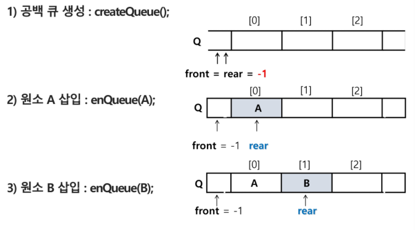
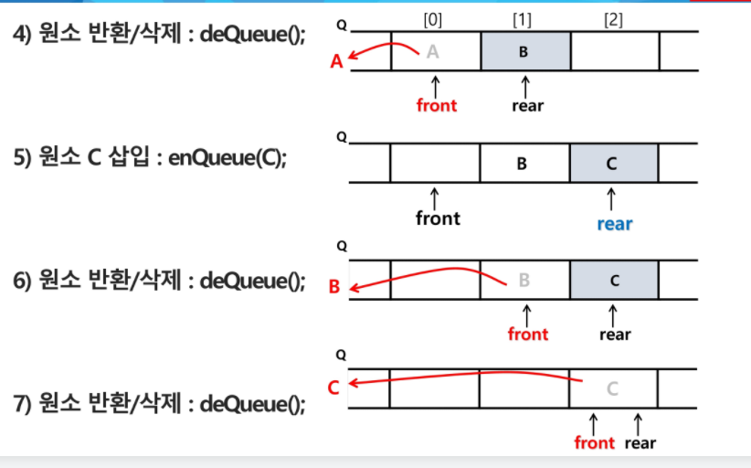

# Queue

---

### 

### Queue란?

- Queue는 기본적으로 stack과 동일하게 자료를 삽입, 삭제할 수 있는 자료 구조이다.

- 다른 점은 Queue에 삽입한 순서대로 원소가 저장되고, 가장 먼저 삽입한 원소는 가장 먼저 삭제가 된다. (선입 선출)

- Queue의 자료 인덱스를 가리키는 두 가지 변수가 존재한다.

- 머리(front)와 꼬리(rear)로 통상 지칭한다.

- Stack과 마찬가지로 원소를 삽입, 삭제할 때 Queue가 꽉찼는지, 비었는지 확인해야한다.





- 삽입과 삭제는 다음과 같이 이루어 진다.

- 초기 상태는 front = rear = -1이다.


---

### 생각해볼 점

- Queue를 사용할 때 front와 rear를 두지 않고 append와 pop(0)을 이용하여 Queue를 사용할 수도 있다.

- 하지만 이런 경우,  삽입과 삭제가 많이 일어날 경우, 제일 앞에 있는 요소가 삭제되면, 다른 요소들이 한 칸씩 땡겨야 되서 비효율적이다.

- 그렇다고 front와 rear를 사용하자니, 초기 Queue의 범위를 어떻게 잡아줘야 할 지 의문이다.

---


### 연관 모듈

- Queue를 효율적이고 쉽게 사용하기 위해 collections모듈에서 deque()라는 것을 지원하다.

```python
from collections import deque
Q = deque()
for i in range(10):
    Q.append(i)
for i in range(10):
    Q.leftpop()
```

- 위와 같이, 데크를 사용하면 편하다.

- 코딩테스트시 모듈 제한사항이 없다면 사용하면 좋다.
